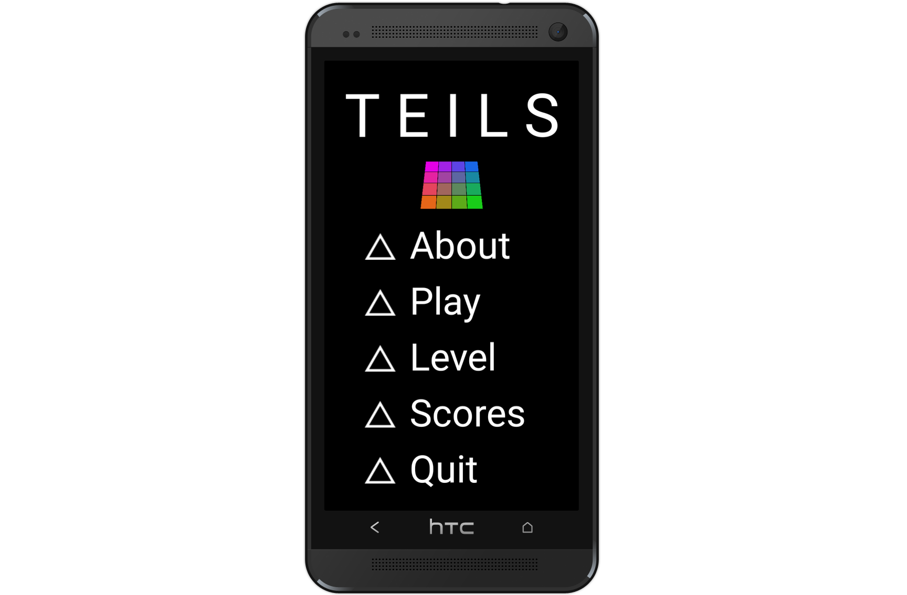

# T E I L S *(/tīls/)*




## How to play

### Go for flat

Goal is to allign a 4x4 tile matrix in all-flat position.  

Hit the *influencers* (triangles at the bottom) to modify the current tile arrangement. Make sure to arrange all tiles in flat position. You only have a limited amount of moves.


*(Mockup by [dunnnk.com](http://dunnnk.com/))*

### Game Dynamics

The game dynamic follows the following simple rules:  

 1. Each tile has 3 states, represented by its tilt:
   * flat
   * tilted to the right
   * tilted to the left  
 2. Each influencer is wired to fixed set of tiles. The wiring changes on every session.
 3. Each influencer iterates between three cyclic states: *dark-gray, light-gray, white*.
 4. When hit, an influencer advances by one state and tilts the attached tiles. Those may spin left or right, but the sense is deterministic.

*Note: There is an algorithm to always win the game.* 

## Installation

This repo hosts the game apk. There are two simple ways to install the file:

### Installation via browser

Access this web page with your android device, then click **[this link](https://github.com/kartoffelquadrat/Teils/blob/master/binary/teils.apk)**.

*Note: Depending on your device settings you may see a popup to confirm the installation from unknown sources. This happens because you install from a source other than the official google play store.*

### Installation via USB-debugging
 
You can also sideload the game on your android, using a computer:

 1. Connect your device via USB
 2. Enable USB debugging on your device
 3. Download the [game apk](https://github.com/kartoffelquadrat/Teils/blob/master/binary/teils.apk).
 4. Open a terminal and run ``` adb install teils.apk```

## Compile from sources

You can also compile the app from scratch. I last tested it with [Android Studio 3.4.2](https://developer.android.com/studio) for MacOS.

## Origin, Author, Copyright

 * Teils was originally written around fall 2016. Minor bugfixes and feature updates followed over the recent years.  
 * Author: Maximilian Schiedermeier
 * Teils is under GNU/GPL. Feel free to contact me for pull requests.  


